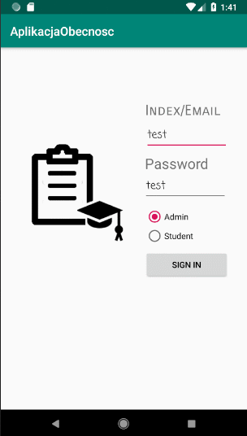

# AplikacjaObecnosc - attendance list app
Attendace list is a mobile app for student and lecturer. Purpose of the project is check student present.
Mobile app is divided into two parts: Administrator can add lectures and manage student accounts
and Student who can add own presence to attendance list.
The project will be created for the needs of graduation work.

## Screenshots

## Technologies
    
 Programming language: Java version 8 update 201
 Toolkit: Android Studio 3.3.2

## Setup
 Project should be run in the Android version 8.1 (API level 27)

## Features
 List of features ready.

            Administrator capabilities:

            - login to the system

            - display list of students

            - add / delete the student account

            - change of the student account password

            - add / edit / remove lectures

            Student options:

             - Login to the system

             - display a list of all classes
             
             - password change
             
 TODOs for future development.
 
            - Administrator edit student account
            - Administrator edit lectures
            
            - Student sign up for a list of attendance at specific classes
            - Student edit information about yourself
            - Student will be use electronic ID to mark presence on lecture

## Status
Project is: in progress.

## Inspiration
This app is inspired by Microsoft documentation
(https://docs.microsoft.com/pl-pl/azure/app-service-mobile/app-service-mobile-android-how-to-use-client-library)

## Contact
Created by Michał Respekta (email: michal.respekta@gmail.com ) - feel free to contact me!
